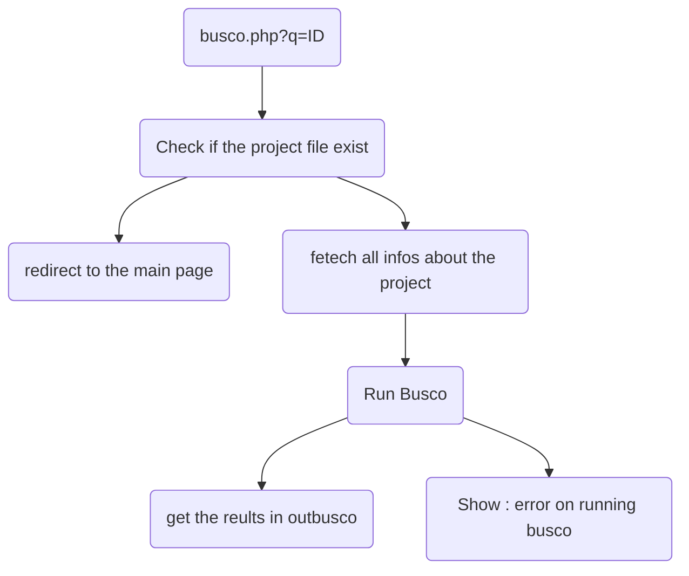
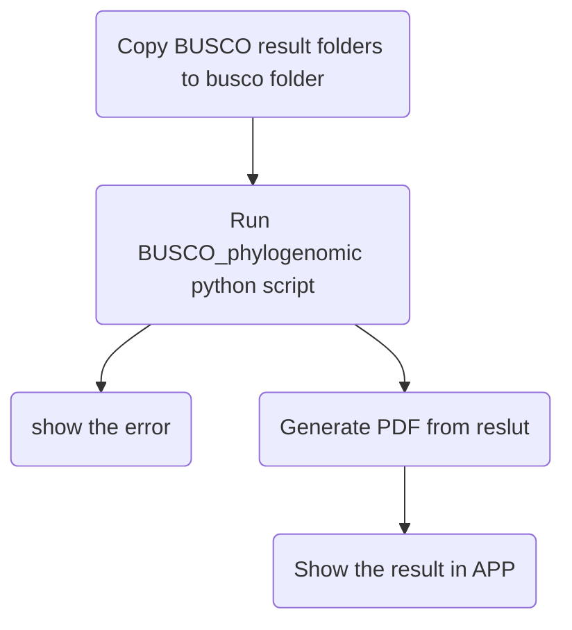

# BuscoPhylo
Thanks to the advances in DNA sequencing technolgies, thousands of genome sequences of living organisms are being released in the public databases every day.  **BuscoPhylo** has been implemented to provide a fully automated and complete pipeline to quickly perform BUSCO-based phylogenomic analysis starting from assembled genome sequences as inputs. The BuscoPhylo is a free, on-line and user-friendly webserver accepting genome sequences in FASTA format as inputs and enabling to the user to export the tree ready for publication and all the results of the steps included in the pipeline for downstream analyses.
 <br>


# Installation


<p>Download the application from GitHub https://github.com/alaesahbou/Busco_based_phylogenomics_app, and extract the zipped file in your server (ampps, xampp, WAMP, online server …)
Then configure your database setting by editing the file <code>config.app.php</code></p>

## Login as a root in Terminal And give Daemon access to the application directory
````bash
# Login as Root
sudo -s
#Give daemon access folder
chown daemon path/to/app_dir

````

## Configure php
````bash
# open the file with a text manger
vim /etc/php5/cli/php.ini

# change these lines:
max_file_uploads=5000
upload_max_filesize=8000M
post_max_size=8000M
````


# Requirements
<ul>
  <li><code><a href="https://busco.ezlab.org/busco_userguide.html">BUSCO</a></code></li>
  <li><code><a href="https://www.python.org/">Python</a></code></li>
  <li><code><a href="https://biopython.org/">BioPython</a></code></li>
  <li><code><a href="https://www.drive5.com/muscle/">MUSCLE (v5)</a></code></li>
  <li><code><a href="http://trimal.cgenomics.org/">trimAl</a></code></li>
  <li><code><a href="http://www.iqtree.org/">IQ-TREE</a></code></li>
  <li><code><a href="http://etetoolkit.org/download/">ETE3</a></code></li>
</ul>

<h1>APP Manuel</h1>
<center></center>
<h2>Creatre Project :</h2>
<h3>I- Insertion :</h3>
<center></center>
<h3>II- Show data :</h3>
<center></center>
<h2>Run BUSCO :</h2>
<h4>RUN ---[PROJECT ID]---> busco.php</h4>


<h2>Generate Phylogenomic Tree :</h2>


<h2>Show Result :</h2>

<h5>Result Exemple : <a href="http://196.200.148.216/assets/tree.pdf" target="_blank">tree.pdf</a></h5>
